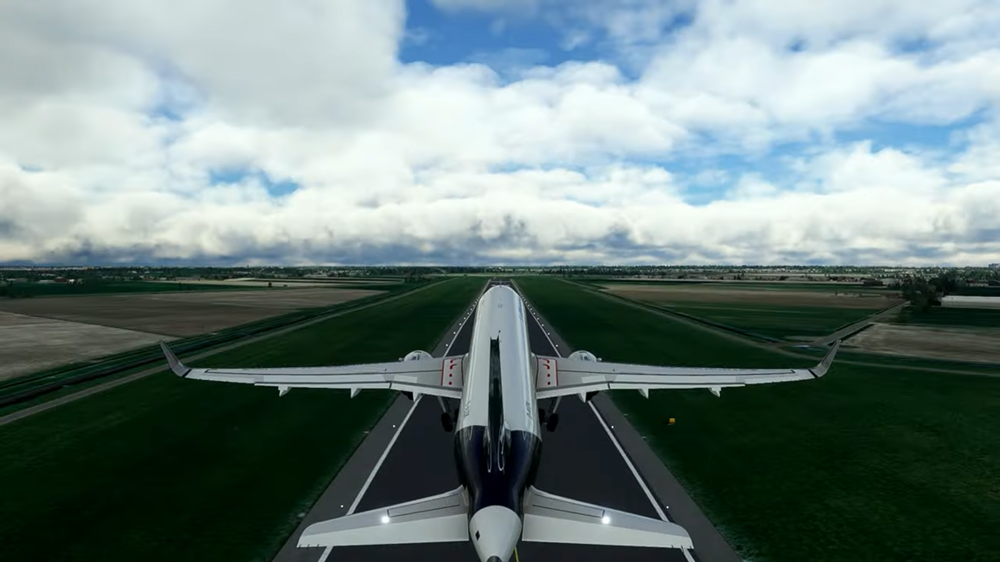
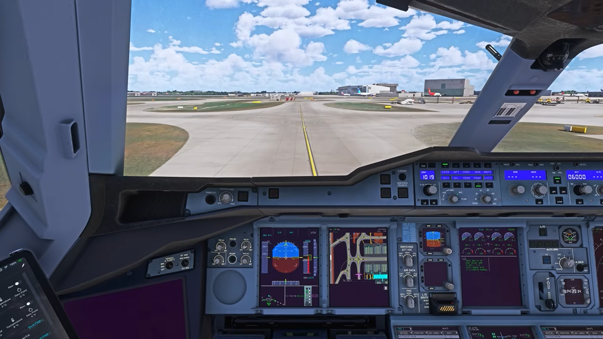
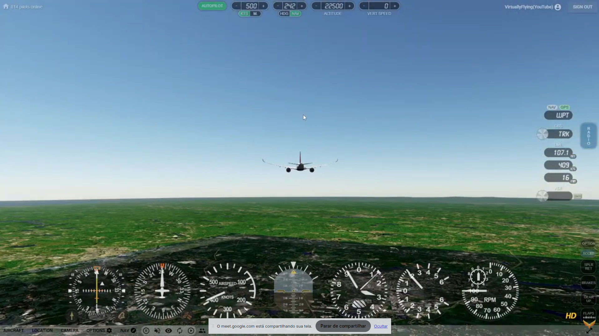

# Especificação da Implementação

> [!CAUTION]
> - Você <ins>**não pode utilizar ferramentas de IA para escrever esta
>   especificação**</ins>

> [!WARNING]
> - Após a entrega da primeira versão completa, esta especificação não
>   poderá ser alterada. A implementação final deverá corresponder ao que
>   estiver descrito neste arquivo.

## Integrantes da dupla

- **Aluno 1 - Nome**: João Luis Scheffel Koller
- **Aluno 1 - Cartão UFRGS**: 00589701

- **Aluno 2 - Nome**: Vítor Santana Feijó
- **Aluno 2 - Cartão UFRGS**: 00588403

## Detalhes do que será implementado

- **Título do trabalho**: Caelum
- **Parágrafo curto descrevendo o que será implementado**: 
O nosso trabalho  será a implementação de um simulador de voo em avião de física simples (não há a pretensão de ela ser muito realista). \ Haverá três perspectivas de gameplay: a do piloto em primeira pessoa na qual será possivel mover-se e ver toda a cabine(cockpit). Adicionalmente, haverá a perspectiva em terceira pessoa do avião a qual será uma câmera look-at focada no avião, acompanhando seu movimento. Por fim será implementado uma visão "god mode" em que será possivel se mover livremente pelo cenário (independentemente da posição do avião). O mundo gerado (solo) terá igualmente texturas simples e nele haverá mais de uma pista de decolagem e pouso para que o avião se desloque de um ponto do mapa para outro.
A movimentação do avião será controlado pelo teclado, o W será o acelerador e S o freio, e o mouse controlará para onde o avião estará mirando, mas caso o botão direito estiver apertado será possivel mover a câmera.

## Especificação visual

### Vídeo - Link

> [!IMPORTANT]
> - Coloque aqui um link para um vídeo que mostre a aplicação gráfica
>   de referência que você vai implementar. **Sua implementação deverá
>   ser o mais parecido possível com o que é mostrado no vídeo (mais
>   detalhes abaixo).**
> - **Você não pode escolher como referência: (1) algum trabalho realizado
>   por outros alunos desta disciplina, em semestres anteriores. (2) Minecraft.**
> - Por exemplo, você pode colocar um vídeo de um jogo que você gosta,
>   e seu trabalho final será uma re-implementação do jogo.
> - O vídeo pode ser um link para YouTube, Google Drive, ou arquivo mp4 dentro
>   do próprio repositório. Mas, garanta que qualquer um tenha
>   permissão de acesso ao vídeo através deste link.

https://www.youtube.com/live/HXZ2hlLK9Qg?si=3gEkvlRpy14oUR3d

### Vídeo - Timestamp

> [!IMPORTANT]
> - Coloque aqui um **intervalo de ~30 segundos** do vídeo acima, que
>   será a base de comparação para avaliar se o seu trabalho final
>   conseguiu ou não reproduzir a referência.

- **Timestamp inicial**: 1:38
- **Timestamp final**: 2:08

### Imagens

> [!IMPORTANT]
> - Coloque aqui **três imagens** capturadas do vídeo acima, que você
>   irá usar como ilustração para as explicações que vêm abaixo.
> - As imagens devem estar armazenadas neste repositório, no diretório
>   `images/spec/`, com os nomes `image1`, `image2` e `image3`.
> - Cada imagem deve usar o formato `.jpg` ou `.png`. Ajuste a extensão
>   nos vínculos abaixo para que corresponda ao arquivo armazenado.
> - Escolha imagens que correspondam a momentos do intervalo indicado
>   acima ou que sejam relevantes para a comparação com a implementação.

#### Imagem 1

- **Descrição**: Decolagem do avião

#### Imagem 2

- **Descrição**: Visão de dentro do cockpit

#### Imagem 3

- **Descrição**: Camera livre no video

## Especificação textual

Para cada um dos requisitos abaixo (detalhados no [Enunciado do Trabalho final - Moodle](https://moodle.ufrgs.br/mod/assign/view.php?id=6302370)), escreva um parágrafo **curto** explicando como este requisito será atendido, apontando itens específicos do vídeo/imagens que você incluiu acima que atendem estes requisitos.

### Malhas poligonais complexas

- Avião, piloto, cabine do piloto(cockpit), arvores

### Transformações geométricas controladas pelo usuário

Um exemplo de transformação geométrica controlada pelo usuário será controlar o avião por meio do WS no teclado e mouse. Inclinações de "pitch", "yaw" e "roll" do avião também serão transformações geométricas.

### Diferentes tipos de câmeras

Haverão 3 cameras:
- Camera primeira pessoa dentro do cockpit do avião (camera fixa livre)
- Camera terceira pessoa na perspectiva do avião (camera look at)
- Camera totalemente livre "god mode"

### Instâncias de objetos

Haverão varios aviões iguais intanciados em cada aeroporto e no ceu. Além disso, varias arvóres estarão espalhadas pelo mundo.

### Testes de intersecção
Avião com os predios do aeroporto, terreno e arvóres.

### Modelos de Iluminação em todos os objetos

- modelo de reflexão de Phong

### Mapeamento de texturas em todos os objetos

Objetos que terão textura:
Aviões, cabine, pista de decolagem, prédios, grama, arvóres. 

### Movimentação com curva Bézier cúbica

- Haverá outro avião voando pelo ceu seguindo uma curva de Bézier

### Animações baseadas no tempo ($\Delta t$)

- Arvóres se movimentarão para simular o efeito do vento 
- Animação do avião voando pelo céu será baseada no tempo

### Funcionalidade extra obrigatória

> [!IMPORTANT]
> - Descreva a funcionalidade extra relacionada à Computação Gráfica
>   que será implementada.
> - Esta funcionalidade também deverá ser documentada no arquivo
>   `README.md` da entrega final.

- Interface Gráfica: Botões para escolher qual avião você usara para pilotar
- Instrumentos/Sensores do avião:
  - altitude
  - velocidade
  - rpm do motor
  - bússola
  - inclinação (row) do avião
- Camera totalemente livre "god mode"

## Limitações esperadas

> [!IMPORTANT]
> - Coloque aqui uma lista de detalhes visuais ou de interação que
>   aparecem no vídeo e/ou imagens acima, mas que você **não pretende
>   implementar** ou que você **irá implementar parcialmente**.
> - Para cada item, **explique por que** não será implementado ou por
>   que será implementado parcialmente.

- Sem mapeamento de terrenos reais
- Minimapa
- Colisão não deformará modelos
- Simulação de voo simplificada
- Interface gráfica mais simples
- Sombras
- Física simplifica
  - Peso do avião, resistência do ar, distribuição de forças de sustentação serão desconsideradas
- Cockpit não será interagível
